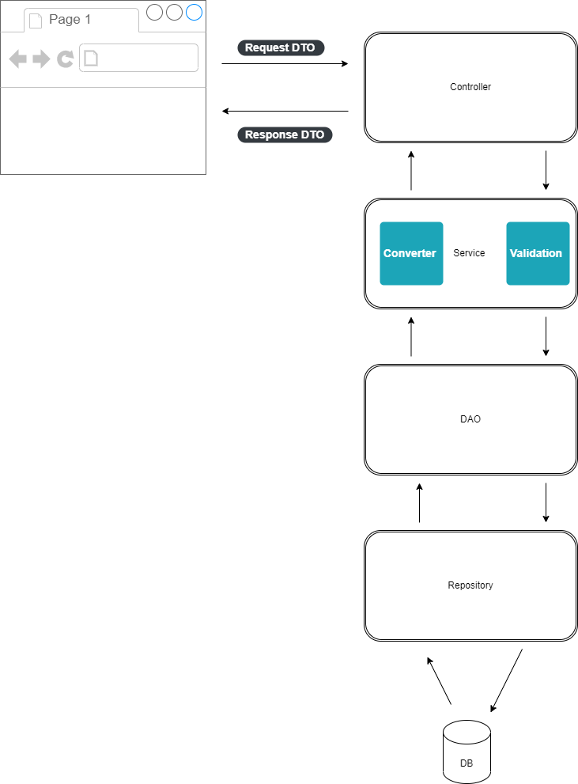
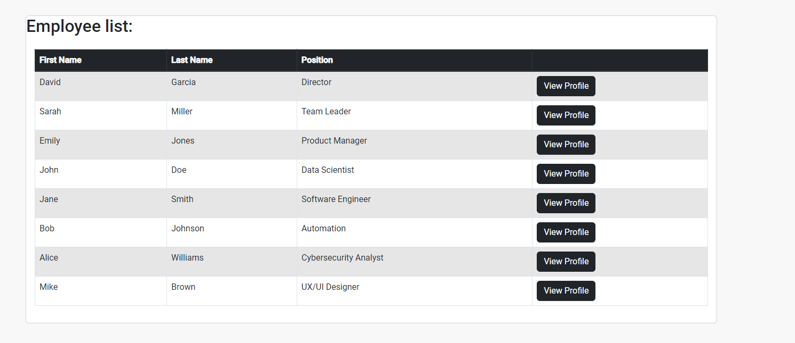
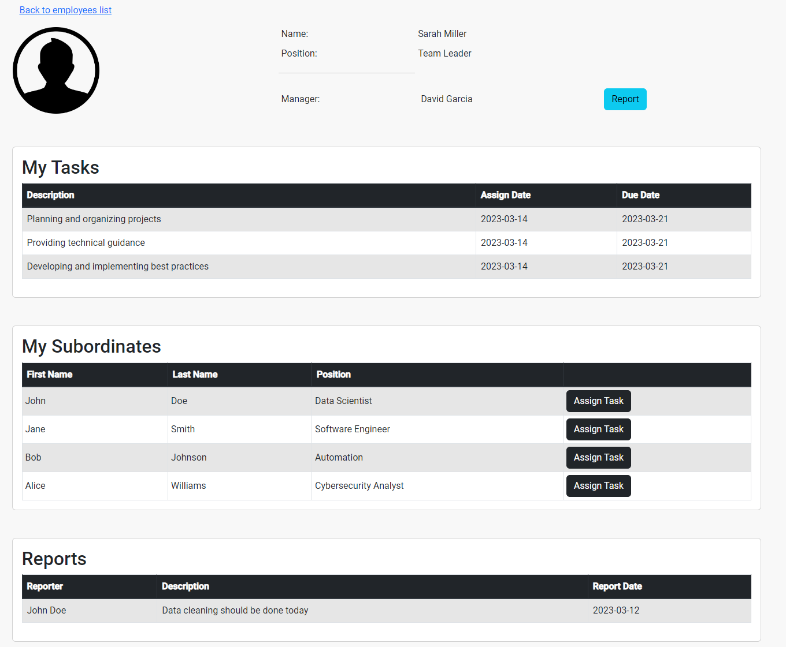

In this project we are able to view and manage organization employees
The organization have 2 type of persons:
- Employee
- Manager

We can view the list of all employees (include managers)
then we can navigate to specific profile.

In the profile page we can see the employee details
We can also back to employees list
If the employee have manager we will see the name of the direct manager,
and an option to report him some message
When defining a report we need to specify the message that will display in manager profile
In addition we will have tasks table that display all the tasks that belong to the specific employee
If the specific employee is a manager and have subordinates employees,
we will see a table with all the subordinates, and an option to assign to each
of them a new Task
When defining a task we need to specify the task description and the due date.
Also if it is a manager we will see a table with all the reports that his subordinates reported.

# Client
This project was generated with [Angular CLI](https://github.com/angular/angular-cli) version 15.2.2.
> **Note:** I'm not a client expert there might be best practices of my implementation.

# Server
This project was generated with Java version 17.

## Development server
The server design to handle request and works

###Controller 

Mapping all HTTP request

###Service

Handle all BL includes:
- Validators
- Converters

###DAO

Data access layers

###Repository

DB access

###DB

Based on H2 DB

--------
###DB Schemas:

- EMPLOYEES - contain discriminator of Employee/Manager

| DISCRIM_EMPLOYEE | PK | FIRST_NAME | LAST_NAME | MANAGER_PK | POSITION |
|------------------|----|------------|-----------|------------|----------|

- TASKS

| PK | ASSIGN_DATE | DESCRIPTION | DUE_DATE | OWNER_PK |
|----|-------------|-------------|----------|----------|

- Reports

| PK | OWNER_PK | REPORT_DATE | REPORTER_PK | TEXT |
|----|----------|-------------|-------------|------|

-------
The data objects are store and retrieved as Entities
for client-server communication I'm using DTOs

---
## Screenshots
### Employee list

### Employee profile

